# Введение

## Что такое математическое моделирование

Математическое моделирование — это один из методов научного познания, при котором реальный объект, процесс или явление (**моделируемый объект**) заменяется их упрощённым представлением в виде системы математических выражений (уравнений, неравенств, алгоритмов), отражающих ключевые свойства, взаимосвязи и динамику изучаемой системы (**моделью**). Часто модель носит междисциплинарный характер, однако также часто модель относится к определенной предметной области. Вот пример известной модели перехода массы в энергию.

$$E=mc^2$$

В биологии и медицине модель описывает физиологические, биохимические, анатомические или эпидемиологические процессы с помощью количественных переменных (концентрации, давления, потоки, численности клеток, вероятности событий) и параметров, имеющих биомедицинскую интерпретацию (скорости реакций, коэффициенты диффузии, периоды полувыведения, коэффициенты передачи инфекции).

Важно понимать, что модель **не претендует на полное воспроизведение реальности** по двум причинам: она строится на определенных явно сформулированных допущениях (однородность ткани, пренебрежение отдельными регуляторными контурами, усреднение по популяции) и предназначена для решения лишь ограниченногокласса задач — объяснения механизмов, прогноза исходов, оптимизации вмешательств или проверки гипотез.

## Для чего оно нужно медикам

Для медиков математическое моделирование служит инструментом перехода от качественных описаний к количественному, проверяемому анализу клинических и исследовательских задач. Основные направления применения включают:

- **Диагностику и прогноз.** Модели позволяют формализовать динамику заболевания, оценивать влияние терапевтических вмешательств и прогнозировать индивидуальные исходы (риск осложнений, ответ на терапию, выживаемость).

- **Понимание механизмов болезни.** С помощью моделей расшифровывают структуру регуляторных систем, оценивают роль отдельных механизмов (например, иммунного ответа, гормональной обратной связи, гемодинамики) и проверяют гипотезы о патогенезе.

- **Оптимизацию лечения.** Персонализированные модели используются для подбора доз препаратов, режимов введения, схем комбинированной терапии, планирования хирургических вмешательств и реабилитации.

- **Эпидемиологию и общественное здоровье.** Модели распространения инфекций (SIR, SEIR и их расширения) применяются для прогноза заболеваемости, оценки эффективности карантина, вакцинации и других мер контроля.

- **Фармакологию и разработку лекарств.** Фармакокинетические и фармакодинамические модели описывают всасывание, распределение, метаболизм, выведение препаратов и их действие на целевые системы, что сокращает объём доклинических и клинических испытаний.

- **Организацию медицинской помощи.** Методы оптимизации и теории очередей используются для распределения ресурсов (койки, оборудование, персонал), снижения времени ожидания и планирования расписаний.

Таким образом, моделирование становится частью доказательной и персонифицированной медицины, позволяя врачу и исследователю работать с количественными сценариями вместо интуитивных предположений.

## Какая нужна математика для моделирования

Для работы с биомедицинскими моделями достаточно базового, но системного набора математических дисциплин. В рамках данного пособия мы последовательно вводим необходимый минимум в контексте конкретных задач. По ходу изложения мы обсудим (безусловно, на базовом уровне):

- **Дифференциальное и интегральное исчисление.** Понимание производной как скорости изменения, интеграла как накопленной величины, навыков работы с элементарными функциями необходимо для формулировки и анализа динамических моделей (рост популяций, изменение концентраций, динамика эпидемий).

  - Несмотря на легенды о страшном математическом анализе, для понимания примеров работы достаточно просто помнить, что производные отражают изменения, движение чего либо (например, скорость роста количества бактерий в популяции), а нам, как правило, нужно знать исходную величину, то есть само количество бактерий.

- **Обыкновенные дифференциальные уравнения (ОДУ).** Большинство рассмотренных моделей (экспоненциальный и логистический рост, SIR/SEIR, фармакокинетика, модели опухоли, глюкоза–инсулин) формулируются в виде систем ОДУ первого порядка. По ходу изложения вы получите базовое понимание таких понятий как: решение, начальные условия, устойчивость, фазовые траектории.

  - Большая часть этих понятий очень наглядная. Например, что такое решение дифференциального уравнения? Это и есть нужный нам результат моделирования: скажем, сколько больных заболеет гриппом по дням недели, если мы смоделировали скорости заболевания и выздоровления.
  - $F=ma$ - известный второй закон Ньютона является не просто дифференциальным уравнением, а уравнением второго порядка, потому что $a$ - это ускорение, а оно - первая производная по времени от скорости и вторая - от координаты, то есть $a=\dot{v}=\ddot{x}=\frac{d^2x}{dt^2}$.

- **Элементы линейной алгебры.** Векторы состояний, матрицы параметров, собственные числа и собственные векторы возникают при анализе устойчивости стационарных состояний и при работе с многокамерными моделями.

- **Теория вероятностей и математическая статистика.** Для стохастических моделей рождения–гибели, оценки параметров по экспериментальным данным, построения доверительных интервалов и проверки гипотез необходимы базовые понятия распределений, случайных величин, оценок параметров и статистических тестов.

- **Численные методы.** Поскольку аналитические решения доступны лишь для простейших моделей, важно понимать идеи численного интегрирования ОДУ (методы Эйлера, Рунге–Кутты), дискретизации, оценки погрешности и устойчивости схем.

В пособии эти разделы математики вводятся не абстрактно, а в привязке к конкретным биомедицинским задачам: каждый новый математический объект сразу получает физиологическую или клиническую интерпретацию.

## Какие можно использовать средства моделирования, если вам не хватит Julia

Современное математическое моделирование в биологии и медицине опирается на комбинацию математических пакетов, языков программирования и специализированных платформ. Основные группы средств:

- **Универсальные языки программирования.** Python, R, Julia, MATLAB/Octave, C++ и другие позволяют реализовывать модели «с нуля», гибко настраивать численные схемы и интегрировать модели в более крупные программные комплексы.

- **Специализированные математические пакеты.** MATLAB/Simulink, Mathematica, Maple, GNU Octave предоставляют встроенные решатели ОДУ, средства символьных преобразований, оптимизации и визуализации, что удобно для прототипирования и обучения.

- **Биоинформатические и биомедицинские платформы.** COPASI, SBML-совместимые среды, CellML-инструменты, специализированные пакеты для системной биологии и физиологического моделирования ориентированы на работу с биохимическими сетями, сигнальными путями и многоуровневыми моделями.

- **Статистические среды.** R, Python (scipy, statsmodels), Stata, SAS используются для статистического анализа данных, оценки параметров моделей, проверки гипотез и построения регрессионных и смешанных моделей.[nsportal+1]{.underline}

- **Средства визуализации и отчётности.** Jupyter-ноутбуки, R Markdown, Quarto, LaTeX позволяют объединять код, расчёты, графики и текст в воспроизводимые документы и учебные материалы.[[scienceforum]{.underline}](https://scienceforum.ru/2019/article/2018014077)

Выбор конкретного инструмента зависит от задачи (обучение, исследование, клиническое приложение), уровня подготовки пользователя, требований к производительности и воспроизводимости, а также от доступной инфраструктуры.

## Почему именно Julia

В данном пособии в качестве основного инструмента выбран язык программирования **Julia**. Это решение обусловлено сочетанием требований учебной задачи, научных расчётов и долгосрочной воспроизводимости проектов.

- **Высокая производительность при удобстве высокого уровня.** Julia компилируется «на лету» (JIT-компиляция) и обеспечивает скорость, близкую к C/Fortran, при синтаксисе, сопоставимом по удобству с Python или MATLAB. Это позволяет студентам и исследователям писать понятный код без потери эффективности при работе с большими моделями и длительными вычислительными экспериментами.

- Вот простая ячейка с расчетом в Julia:

  - Что она делает? Рассчитывает очень сложное выражение $2+2$. Затем выводит результат на экран (часто говорят "консоль") с помощью команды `println` и мы видим ответ 4.

```{julia}
println(2+2)
```

Еще один пример, более сложный. Все, что начинается с символа \# - это комментарии, которые поясняют нам, читателям, что делает определенная часть кода. Для понимания остальной части кода следует объяснить, что Julia - это экосистема. Она включает как сам более-менее универсальный язык, так и множество пакетов (иногда их также называют модулями или библиотеками) которые решают более узкие задачи. В частности, строки ниже подключают менеджер пакетов (using Pkg), а этот менеджер выводит список пакетов текущего проекта на экран командой Pkg.status().

Возникает резонный вопрос: как получить эти пакеты? Если у вас есть доступ к сети интернет, то их надо скачть и подключить к вашей версии Julia. Вот этим и занимается менеджер пакетов. Вы отдаете ему команду: добавь к моей системе определенные пакеты, и менеджер (Pkg) сам, без вашего участия выполняет остальную работу

```{julia}

# Выведет точный путь к используемому файлу Project.toml
println("Активный Project.toml: ", Base.active_project())

# Выведет информацию об окружении и активных пакетах
using Pkg
Pkg.status()
```

- **Специализированная экосистема для научного моделирования.** Пакеты **DifferentialEquations.jl**, **ModelingToolkit.jl**, **SciMLSensitivity.jl**, **Optimization.jl** предоставляют современные решатели ОДУ, ДАУ, стохастических дифференциальных уравнений, средства автоматического дифференцирования, оценки параметров и оптимизации, что критично для биомедицинских задач (подбор параметров по данным, чувствительность, обратные задачи).

Большинство файлов, с которыми работает Julia, имеют расширение jl - julia language. Некоторые из них можно установить из сети интеренет и использовать в своих программах, но для этого надо сказать Julia: я подключаю этот пакет. Это делается строчкой using, например, `using Pkg` - использовать в программе модуль Pkg. **Важно:** регистр символов надо соблюдать, то есть `using Pkg` и `using pkg` - это разные команды, первая правильная, вторая - нет.

- **Удобство для обучения.** Читаемый синтаксис, интерактивная работа в REPL и Jupyter-ноутбуках, богатая система документации и сообщений об ошибках делают Julia подходящим языком для студентов медицинских и инженерных специальностей, не имеющих глубокой подготовки в программировании.

- **Воспроизводимость и открытость.** Julia и основные научные пакеты имеют открытый исходный код, что упрощает проверку, модификацию и долгосрочную поддержку учебных и исследовательских проектов. Возможность фиксировать версии пакетов и окружения способствует воспроизводимости вычислительных экспериментов — ключевому требованию современной науки.

- **Интеграция с другими языками.** Julia легко взаимодействует с Python, R, C/Fortran, что позволяет использовать существующие библиотеки, данные и наработки, не переписывая их полностью.

Для целей данного пособия Julia представляет баланс между доступностью для студентов-медиков и достаточной мощностью для серьёзных исследовательских задач в области биомедицинского моделирования.

## Как организована эта книга

Настоящее пособие построено вокруг **избранных моделей**, и не является ни справочником по Julia, ни энциклопедией всех известных биомедицинских моделей. Каждая глава следует единой логической структуре, отражающей полный цикл работы с моделью:

1.  **Биомедицинская задача.** Формулировка клинической, физиологической или исследовательской проблемы, которую призвана решить модель (например, прогноз распространения инфекции, оценка режима дозирования препарата, анализ роста опухоли). Автор сознательно допускает некоторые упрощения в формулировках и пропускает "самоочевидные" формулировки.

2.  **Допущения.** По возможности явное перечисление упрощений, на которых строится модель (однородность популяции, пренебрежение отдельными регуляторными контурами, детерминированность vs стохастичность), с обсуждением их биологического смысла и границ применимости. Тем не менее, автор больше заинтересован в переходе к моделированию, чем к математически строгому описанию всех возможных ограничений.

3.  **Математическая модель.** Формальная запись модели в виде уравнений, определение переменных, параметров, начальных условий и единиц измерения; краткое обсуждение качественных свойств (стационарные состояния, устойчивость, типичные режимы динамики). Автор стремился, насколько возможно, предоставлять полную информацию такого рода, однако часто дает сссылки на предыдущие модели , чтобы показать эволюцию развития отдельных моделей более четко.

4.  **Реализация на Julia.** Пошаговое построение кода с использованием пакетов DifferentialEquations.jl, ModelingToolkit.jl и других; акцент на читаемости, воспроизводимости и связи каждой строки кода с биомедицинским смыслом. Зачастую, вместо оптимального, но плохо читаемого кода, автор приводит более длинные версии расчетных модулей.

5.  **Вычислительный эксперимент.** Серия расчётов для различных наборов параметров и начальных условий, включая сценарии «что, если» (изменение дозы, введение карантина, изменение чувствительности опухоли к терапии). Для проведения интерактивных экспериментов рекомендуется использовать интерактивные блокноты Pluto. К сожалению, эту интерактивность нельзя воспроизвести в печатном виде или в статичном html файле.

6.  **Интерпретация результатов.** Перевод численных результатов обратно на язык биологии и медицины: что означают полученные кривые, пороги, времена, вероятности для пациента, популяции или исследователя.

7.  **Ограничения применимости.** Обсуждение того, в каких ситуациях модель даёт надёжные качественные и количественные прогнозы, а в каких её использование некорректно; указания на возможные источники ошибок и пути расширения модели.

В конце каждой главы приводятся **контрольные вопросы и задания трёх уровней**:

- **Базовый уровень** — проверка понимания постановки задачи, структуры модели и основных результатов.

- **Средний уровень** — модификация модели, изменение параметров, проведение собственных вычислительных экспериментов.

- **Продвинутый уровень** — постановка мини-исследовательского проекта: оценка параметров по данным, сравнение альтернативных моделей, анализ чувствительности.

Пособие включает следующие темы:

- Основы Julia и организация воспроизводимого вычислительного проекта.

- Экспоненциальный, логистический и Гомперцев рост (популяции клеток, опухоли).

- SIR/SEIR-модели распространения инфекции.

- Однокамерная и двухкамерная фармакокинетика.

- Связанные фармакокинетические и фармакодинамические модели.

- Модели роста опухоли и сценарии терапии.

- Физиологическая модель глюкоза–инсулин (или иная модель с обратной связью).

- Стохастические модели рождения–гибели и вымирания.

# Как подготовиться к работе

Перед началом работы с пособием рекомендуется обеспечить минимально необходимую техническую и организационную инфраструктуру. Ниже приведены требования и рекомендации, ориентированные в первую очередь на операционную систему Windows 11; для других систем (macOS, Linux) даны краткие указания.

- В отличии от многих других "свободных" систем программирования, экосистема Julia остается доступной в России без ограничений.

Автор настоятельно рекомендует:

1.  Работать в среде Windows11x64, причем **имя компьютера и имя пользователя должно быть набрано только латиницей без пробелов и специальных символов**

2.  Желательно **создать директорию под свои эксперименты** и сохранять свою работу в этой директории или ее поддиректориях

3.  Желательно с**облюдать определенную структуру папок**. Часто имеет смысл работать в основной папке (Project1), сохранять результаты в подпапке Results, картинки в Figures а отчеты и т.п. в папке Reports, хотя сам автор далеко не всегда следует этому порядку.

4.  Желательно делать копии своей работы. Можно архивировать свои проекты, но гораздо более удобным является создание репозитория Git

5.  Существуют разные версии кода, которые может выполнить Julia. Чаще всего это обычные скрипты (текстовые файлы jl), но для интерактивных работ лучше подходят блокноты Pluto. Для расчетов в режиме калькулятора существует консоль, которая позволяет выполнить расчеты шаг за шагом (непосредственно в терминале).

## Технические требования

Для выполнения всех вычислительных экспериментов, описанных в пособии, достаточно стандартного современного компьютера:

- **Операционная система:** Windows 11 (основная целевая платформа); также возможны macOS 10.15 или новее, распространённые дистрибутивы Linux (Ubuntu, Fedora, Debian и др.).

- **Процессор:** любой 64-разрядный процессор (x86_64); для большинства моделей достаточно 2–4 ядер.

- **Оперативная память:** минимум 4 ГБ, комфортно — 8 ГБ и более (некоторые эксперименты с оптимизацией параметров или стохастическим моделированием могут требовать больше памяти).

- **Свободное место на диске:** около 1–2 ГБ для самой Julia, пакетов и рабочих файлов (в зависимости от количества устанавливаемых пакетов и объёма данных).

- **Интернет-соединение:** необходимо для первоначальной установки Julia, пакетов и документации; дальнейшая работа возможна офлайн.

## Что желательно знать перед началом

Для комфортной работы с пособием полезно (но не обязательно) иметь базовые представления о:

- **Элементах программирования:** переменные, типы данных, функции, циклы, условия — на уровне любого вводного курса (Python, Pascal, C, MATLAB и др.).

- **Работе с командной строкой/терминалом:** запуск программ, навигация по файловой системе, установка пакетов — на минимальном уровне.

- **Основах математики:** производная и интеграл, простейшие дифференциальные уравнения, элементы теории вероятностей — эти темы будут систематически напоминаться в контексте моделей .

Если какой-то из этих пунктов вызывает затруднения, рекомендуется параллельно с работой над пособием обращаться к вводным материалам по Julia и математике; в тексте будут даны ссылки на соответствующие разделы.

## Как установить Julia

Ниже приведены пошаговые инструкции для установки Julia на Windows 11. Для macOS и Linux даны краткие указания в конце раздела.

### Способ 1. Через Microsoft Store (рекомендуется для Windows 11)

1.  Откройте **Microsoft Store** (меню «Пуск» → значок сумки с логотипом Store).

2.  В строке поиска введите «Julia» и выберите официальное приложение **Julia** (издатель — Julia Computing).

3.  Нажмите кнопку **«Установить»** / **«Get»** и дождитесь завершения установки.

4.  После установки откройте **PowerShell** или **Командную строку** (cmd) и выполните:

    ```         
    julia --version
    ```

    Если отобразится номер версии (например, `julia version 1.13.1`), установка прошла успешно.

Этот способ автоматически добавляет Julia в системный путь и упрощает обновление в будущем.

### Способ 2. Через winget (альтернатива для Windows 11)

Если вы предпочитаете использовать менеджер пакетов `winget`, в PowerShell выполните:

```         
winget install --name Julia --id 9NJNWW8PVKMN -e -s msstore
```

Эта команда установит ту же версию, что и через Microsoft Store.[[docs.julialang]{.underline}](https://docs.julialang.org/en/v1/manual/installation/)

### Способ 3. Через официальный MSI-инсталлятор

Этот способ удобен, если на вашем компьютере нет доступа к Microsoft Store или вы предпочитаете классический установщик.

1.  Перейдите на страницу загрузок: \<https://julialang.org/downloads/\>.

2.  Скачайте 64-битный **MSI-инсталлятор** для Windows (файл вида `julia-1.13.1-win64.exe` или аналогичный).

3.  Запустите скачанный файл и следуйте инструкциям мастера установки.

4.  На одном из этапов установки обязательно отметьте опцию **«Add Julia to PATH»** (Добавить Julia в переменную PATH), чтобы команда `julia` была доступна из любой командной строки.

5.  Завершите установку.

**Проверка установки:**

1.  Откройте **PowerShell** или **Командную строку**.

2.  Повторите как показано выше команду:

    ```         
    julia --version
    ```

    Должна отобразиться версия Julia.

## Что еще нужно (можно) установить

Вы можете использовать только блокнот, чтобы писать простые программы на Julia. Это не самый продуктивный путь, да и работа в таком режиме будет не самой продуктивной. Можно использовать немного более "продвинутые" редакторы, например, Notepad++, Neovim, Emacs

| Neovim | Notepad++ | Emacs |
|--------------------------|---------------------------|-------------------|
| 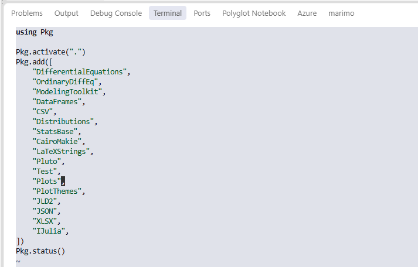 | 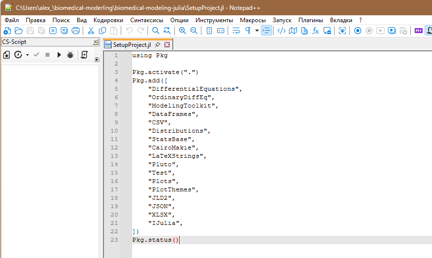{width="287"} | 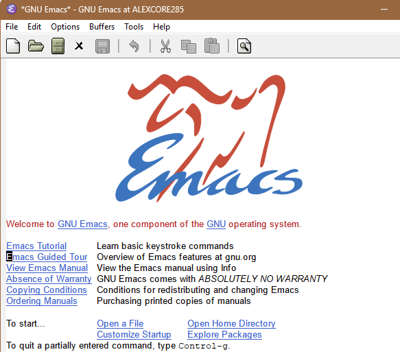{width="192"} |
| Работает в терминале | Нет специального режима работы с Julia |  |

: Внешний вид редакторов

Помимо самой Julia, для комфортной работы с пособием полезно установить ряд дополнительных инструментов: редактор кода, поддержку Jupyter-ноутбуков, графические драйверы и некоторые системные утилиты. Ниже приведён минимальный и расширенный наборы, ориентированные на Windows 11.

### Минимальный набор (обязательно)

#### 1. Редактор кода с поддержкой Julia

Для написания и отладки скриптов Julia рекомендуется использовать **Visual Studio Code (VS Code)** — бесплатный, кроссплатформенный редактор с отличным расширением для Julia.

**Установка VS Code и расширения Julia (Windows 11):**

1.  Скачайте установщик VS Code с официального сайта: \<https://code.visualstudio.com/\>.

2.  Запустите скачанный файл и следуйте инструкциям мастера установки (рекомендуется оставить опцию «Добавить в PATH» и «Зарегистрировать как редактор для файлов .jl»).

3.  Запустите VS Code.

4.  Откройте панель расширений (иконка с квадратами слева или `Ctrl+Shift+X`).

5.  В поиске введите «Julia» и установите официальное расширение **Julia** (автор — Julia Language).[[rudn]{.underline}](https://www.rudn.ru/sveden/files/Progr_Mathmod_v_biol_i_med_NMTmd03r_2021.pdf)

6.  После установки перезапустите VS Code.

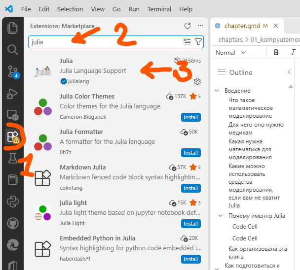

Это расширение обеспечивает:

- подсветку синтаксиса Julia;

- запуск кода непосредственно из редактора;

- отладку;

- интеграцию с REPL;

- работу с ноутбуками `.jl` и `.ipyn`

### 2. Пакеты Julia для работы с моделями

После установки Julia и редактора необходимо установить базовый набор пакетов, которые будут активно использоваться в пособии.

Запустите терминал или командную строку. Напечатайте в строке-прпиглашении julia.

Это приведет к открытию REPL Julia (диалоговой сркды примерно такого вида, как показано ниже) и выполните:

```         
import Pkg

Pkg.add([
    "DifferentialEquations",
    "OrdinaryDiffEq",
    "ModelingToolkit",
    "DataFrames",
    "CSV",
    "Distributions",
    "StatsBase",
    "CairoMakie",
    "Random",
    "SciMLSensitivity",
    "Optimization",
    "OptimizationOptimJL"
])
```

Эти пакеты обеспечивают:

- численное решение ОДУ и других дифференциальных уравнений (`DifferentialEquations`, `OrdinaryDiffEq`);

- символьное моделирование и автоматическое дифференцирование (`ModelingToolkit`, `SciMLSensitivity`);

- работу с табличными данными (`DataFrames`, `CSV`);

- вероятностные распределения и статистику (`Distributions`, `StatsBase`);

- построение графиков (`CairoMakie`);

- генерацию случайных чисел и воспроизводимость экспериментов (`Random`);

- оценку параметров и оптимизацию (`Optimization`, `OptimizationOptimJL`).[[docs.julialang]{.underline}](https://docs.julialang.org/en/v1/manual/installation/)

После установки можно проверить статус пакетов:

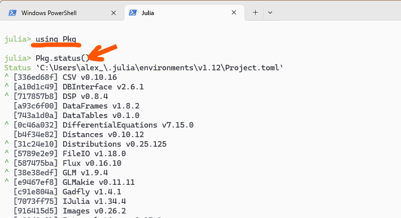

### Расширенный набор (рекомендуется)

#### 1. Jupyter-ноутбуки с поддержкой Julia

Если вы предпочитаете работать в формате ноутбуков (код, текст и графики в одном документе), полезно установить ядро Julia (IJulia) и интерактивный блокнот Pluto.

**Установка IJulia и Pluto(Windows 11):**

Запустите, если вы этого еще не сделали терминал. В терминале, если это нужно, наберите `julia`.

В терминале введите:

```         
using Pkg

Pkg.add("IJulia")
Pkg.add("Pluto")
```

Обе команды скачают необходимые пакеты из сети интернет и установят все необходимое. Если вы введете эти команды в терминале, вы увидите, как пакеты скачиваются и устанавливаются. Если вы повторите эти команды в дальнейшем, вы увидите, сообщение, аналогичное картинке (все пакеты установлены и делать ничего не надо).

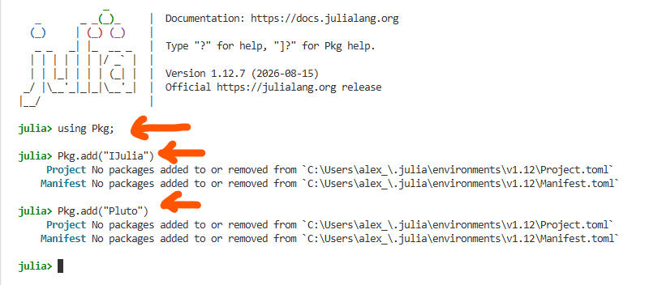

## Первый шаг - запускаем Julia в терминале

Через терминал удобно выполнять техническое обслуживание вашей локальной копии Julia. Например, вы можете обновить вашу версию Julia командой `juliaup update` перед запуском Julia, изучить статус пакетов и работать с программой в режиме калькулятора.

В Windows11 открыть терминал можно так (один из способов):\
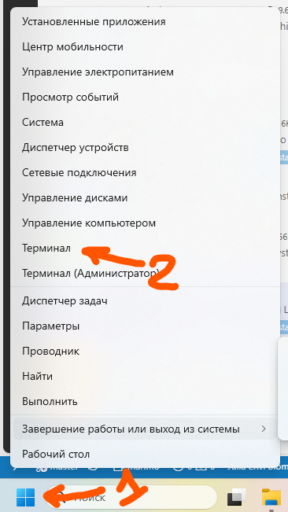

В редакторе Visual Studio Code (далее VSCode) запустить терминал можно через меню:\
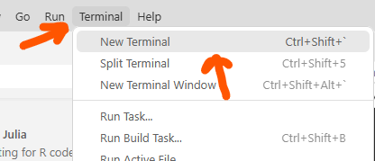

Независимо от способа запуска просто напечатайте в строке ввода julia и нажмите Enter. Когда REPL (диалоговый интерпретатор Julia) запустится, можно вводить команды и получать некоторую реакцию. На рисунке ниже создается переменная `alpha`, равная 45 градусам (точнее, она получает значение 45.0). Точка здесь означает десятичную дробь.

Далее, в новой переменной `alpha_rad = alpha *pi/180.0` мы пересчитываем градусы в радианы, используя известную константу pi. Последняя инструкция рассчитывает синус от угла в радианах c помощью функции sin(x). Она берет аргумент x и преобразует его в синус.

Обратите внимание, результаты расчетов выводятся за строкой с вычислениями. Если вам это не нравится, можно заблокировать вывод, если завершить инструкцию точкой с запятой.

Для завершения рапоты используется еще одна функция exit(). Хотя она не использует аргументы, необходимо использовать скобки для вызова функции.

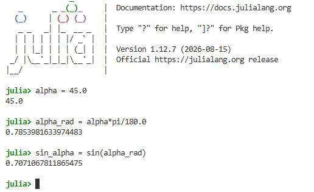

## Второй шаг - запускаем Julia в IDE (Visual Studio Code)

Несколько команд лучше запустить "пакетом", то есть отправить их в Julia разом с помощью файла-скрипта в интегрированной среде разработки - VSCode с плагином julia.

Как минимум, новый скрипт надо создать. Как правило, это файл с расширением jl.

|                          |
|:------------------------:|
|  |
| 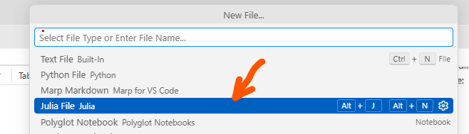 |

: Создание нового скрипта в VSCode

Обратите внимание: строки с символом решетки (#) - это комментарии, читая куоторые можно понять логику работы скрипта.

Сначала к скрипту подключается модуль для создания графиков Plots. Далее мы указываем своего рода "графопостроитель" для построения графиков. После этого используется довольно обычная схема. Создается невидимый параметр t (около 10000 точек в диапазоне от 0 до 20pi). Далее рассчитывается снеачала просто sin(t), затем sin(1.1t).

Собственно график (т.е. figure) строит на условном полотне пары точек y и y1, соединяет их линией и последней командой plot(fig) выводит график на экран.

``` julia
# Построение фигуры Лиссажу в Julia.

using Plots
gr() # Используем графический backend GR.

# Создаём параметр t и вычисляем координаты по обеим осям.
t = range(0, 20π; length=10_000)
y = sin.(t)
y1 = sin.(1.1 .* t .+ π / 4)

# Строим фигуру Лиссажу и явно отображаем её.
fig = plot(
    y,
    y1;
    label="Фигура Лиссажу",
    xlabel="y",
    ylabel="y₁",
    title="Фигура Лиссажу",
)
display(fig)
```

Результат:\
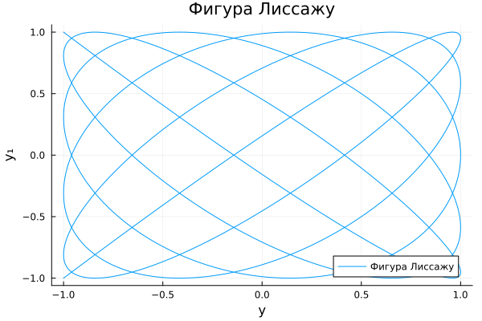

## Третий шаг - запускаем Julia в Pluto

Сначала поставив задачу более конкретно: я хочу, меняя частоты y и y1 получить разные варианты графиков.

Прежде всего, надо устиановить пакет Pluto.jl. Для этого при запущенной Julia в терминале выполните команду `] add Pluto`. После чего вы можете запустить Pluto.jl в терминале командой `pluto`. Важно: когдла вы печатаете \], вы фактически запускаете менеджер пакетов Pkg. При этом вы можете писать все те же команды, но более просто. Например, чтобы установить пакет Pluto.jl, вы можете выполнить команду `] add Pluto`. Через несколько минут вы должны увидеть сообщение, что пакет установлен. После этого вернитесь в обычную среду (нажмите клавишу BackSpace). После чего вы можете запустить Pluto.jl в терминале:


Pluto запустится в вашем браузере по умолчанию, а терминал будет играть роль сервера. В браузере вы найдете вкалдку с приблизительно следующим интерфейсом:

Нажмите "создать новый документ" для начала работы.

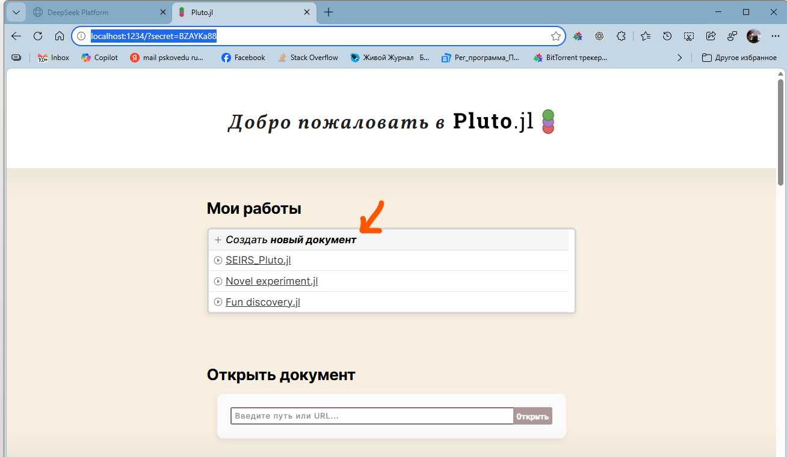

В новом документе вы увидите пустую ячейку. Введите в нее код, как показано на рисунке и нажмите Shift+Enter или отмеченную стрелку

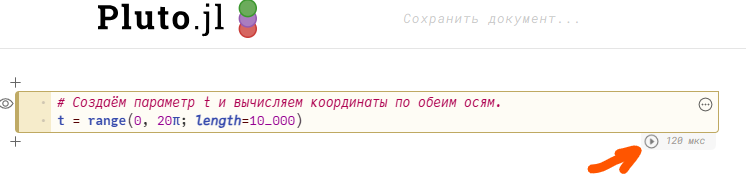


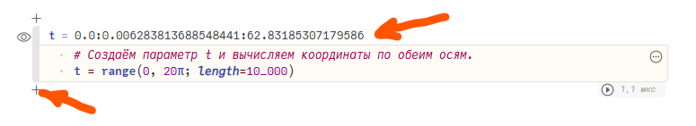

1.  В новой ячейке - несколько выражений, их надо "обернуть" блоком `begin - end`

2.  Для отображения слайдера надо подклюсить интерфейс PlutoUI

3.  Самое сложное:

    1.  я ходу связать (\@bind) переменную k1 и слайдер Slider

    2.  он использует ряд точек от 0,8 до 1,2 с шагом 0,001

    3.  значение слайдера по умолчанию 1 ровно (если перемещать движок, то значение будет другим)

    4.  справа от слайдера будет видно это значение (show_value = true)

4.  Напоминаю, что все, что начинается с символа \# (решетка) является комментарием и печатать их не обязательно)

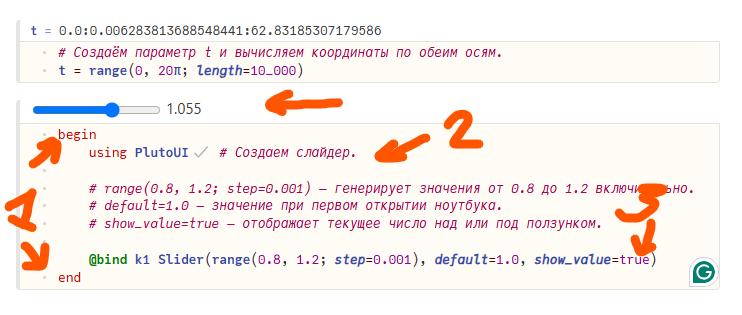

Аналогично создадим (честно говоря - просто скопируем) то же для k2 в новой ячейке (достаточно скопирорвать одну строчку):

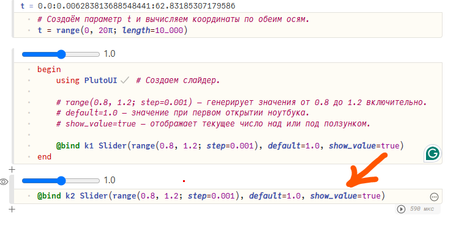

Теперь создадим два синуса (один с частотой k1, а второй - k2) в новой ячейке, обернув их в begin - end

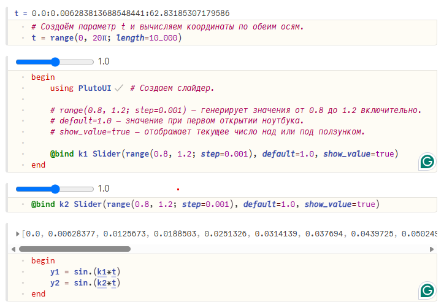

И выведем график:

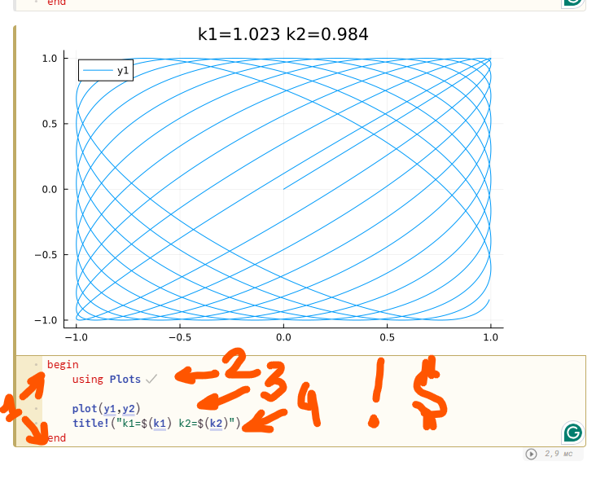

Давайте разберем, что делает эта ячейка.

1.  Просто заполмните, если в ячейке много действий, окружите их блоком begin - end автоматически.

2.  Подключаем модуль с графиками

3.  Печатаем график (условный x здесь y1, а условный y - y2).

4.  Теперь самое сложное.

    1.  В Julia принято писать функции, которые выдают результат, но не изменяют уже имеющиеся объекты. Если, тем не менее, мы хотим что-то изменить, то функция заканчивается на ! (восклицательный знак). Здесь мы **изменяем** график и добавляем к нему заголовок (title!)

    2.  Заголовок это строка, но мы хотим сделать ее изменяемой, чтобы в ней были значения коэффициентов. Такая строка называется **интерполируемой**. Если вы видите в такой строке знак доллара (\$), то выражение за этим ззнаком рассчитывается и подставляется значение выражения. В нашем случае: \$(k1) заменяется на значение 1,023, взятое из ячейки со слайдером.

5.  Покрутите сладеры и вы увидите, как меняется их заголовок, а также общий график (даже на слабых компьютерах этот расчет происходит очень быстро). Это свойство блокнота Pluto называется реактивностью. Если вы меняете какой-то параметр, то блокнот пересчитывается (обычно только зависимые ячейки), а графики, которые затрагивает изменение, перестраиваются.

|                          |                          |
|--------------------------|--------------------------|
| 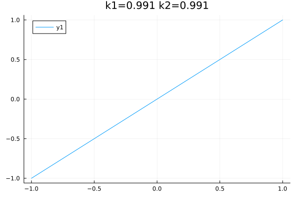 | 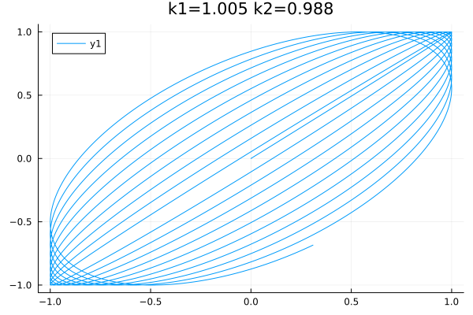 |
| 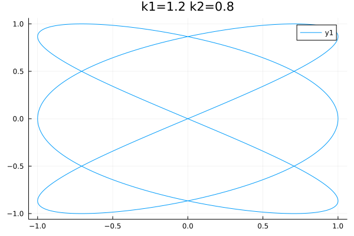 | 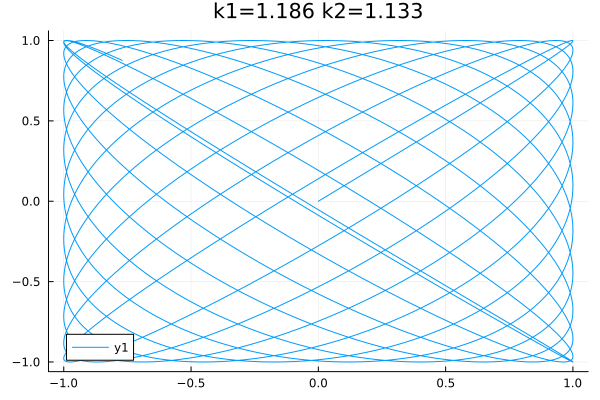 |